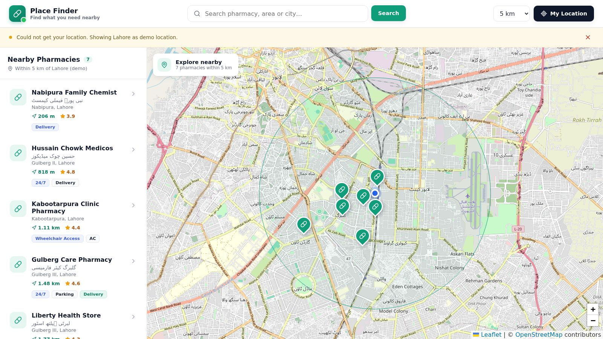

# Place Finder

Find places near you on a map. A list of nearby places on the left, an OpenStreetMap map on the right, a detail page with directions for each one.

It maps real places in São José do Rio Preto, Brazil, and keeps them current with a daily sync from OpenStreetMap: pharmacies, malls, parks, the zoo, rivers and lakes, hospitals, museums and theaters, stadiums, gas stations, ice cream shops and bus stations. Categories, city and branding live in one config file, so it works for anything with a name and a coordinate.

**Live:** https://place-finder-five.vercel.app



## Features

- Nearby search with your browser location and a radius from 1 to 50 km, sorted by distance
- Falls back to a demo location when location is denied or unavailable, and says so
- Text search by name, alternate name, neighborhood or city
- Category filter, with its own color and icon on the list and on the map
- Map with a radius circle, your position and a marker per place
- Detail page with address, phone, website, hours, tags and a Google Maps directions link
- Responsive down to phone width
- Daily sync with OpenStreetMap through Vercel Cron: new places appear, changed ones update, removed ones are hidden
- JSON API with validated input; adding places by hand needs an admin token

Place data comes from [OpenStreetMap](https://www.openstreetmap.org/copyright) (© OpenStreetMap contributors, ODbL).

## Stack

React 19 + Vite · React Router · Leaflet + OpenStreetMap · Express 5 · Mongoose + MongoDB (2dsphere index) · Vercel

## Run it

Requires Node 22 and a MongoDB database (Atlas free tier or local).

```bash
npm install
cp .env.example .env.local        # set MONGODB_URI
npm run sync                      # pulls places from OpenStreetMap (a few minutes the first time)
npm run dev:api                   # http://localhost:3001
npm run dev:web                   # http://localhost:5173
```

No MongoDB around? `docker run -d -p 27017:27017 mongo:7` and use `MONGODB_URI=mongodb://127.0.0.1:27017/place-finder`.

```bash
npm test          # validation and OSM mapping tests (node:test)
npm run check     # tests + production build
```

## Docs

- [Guide](docs/guide.md): architecture, how the code is organized, customization, deploy on Vercel, troubleshooting
- [API reference](docs/api.md)

## License

[MIT](LICENSE)
